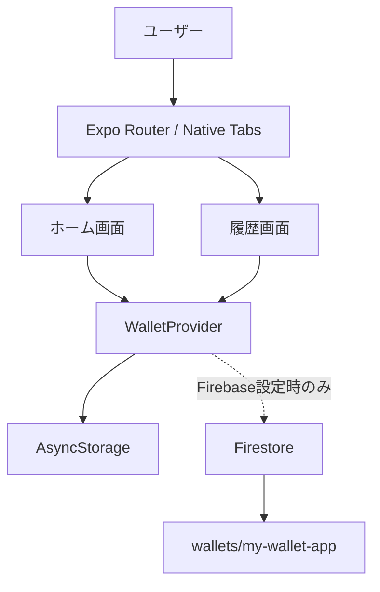
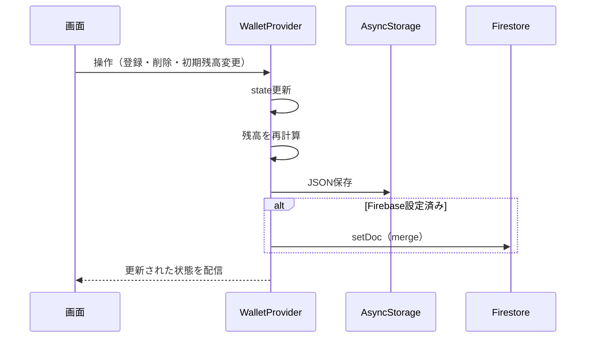

# 財布管理アプリ 設計書

## 1. 文書概要

### 1.1 目的

本書は、iOS向け財布管理アプリ `my-wallet-app` の現行実装を対象に、アプリケーションの構成、機能、データモデル、保存方式および主要な業務ルールを定義する。

### 1.2 対象範囲

- 対象: iPhone向けのExpo / React Native個人向け財布管理アプリ
- iOSアプリ識別子: `com.mywalletapp.wallet`
- 画面方向: 縦向き
- iPad: 非対応
- 対応画面: ホーム、履歴、設定
- 通貨: 日本円（JPY）
- 保存先: AsyncStorage（常用）、Firestore（設定時のみ同期）
- 認証: 対象外。現在は単一ユーザー・単一財布として扱う

### 1.3 前提

- Expo SDK 57、React Native 0.86、React 19 を使用する。
- Expo Router のファイルベースルーティングを使用する。
- Firebase の環境変数が不足している場合でも、ローカル保存だけで利用できる。

## 2. システム構成



### 2.1 レイヤー構成

| レイヤー | 主な責務 | 実装 |
|---|---|---|
| 画面 | 入力受付、表示、操作結果の通知 | `src/app/index.tsx`、`src/app/explore.tsx` |
| ナビゲーション | タブ切り替え | `src/components/app-tabs.tsx` |
| 状態管理 | 残高計算、履歴操作、永続化 | `src/context/wallet-context.tsx` |
| 外部サービス | Firebase初期化、Firestore参照 | `src/lib/firebase.ts` |
| 共通UI | テーマ、テキスト、レイアウト | `src/components/`、`src/constants/theme.ts` |

### 2.2 起動フロー

1. Expo Router がルートレイアウトを読み込む。
2. `ThemeProvider` と `WalletProvider` を生成する。
3. `WalletProvider` が AsyncStorage から状態を読み込む。
4. Firebase が設定済みの場合、Firestore の `wallets/my-wallet-app` を読み込む。
5. Firestore にデータが存在する場合は、ローカル状態よりリモート状態を採用する。
6. 読み込み完了後、画面操作と状態の保存を有効にする。

## 3. 機能仕様

### 3.1 ホーム

#### 残高表示

- 銀行残高、財布残高を表示する。
- 総資産を「銀行残高 + 財布残高」で表示する。
- 今月支出を、当月に作成された支出履歴の合計として表示する。
- 現金比率を「財布残高 / 総資産 × 100」で表示する。
- 総資産が0の場合、現金比率は0%とする。

#### 初期残高の設定

- 設定タブで初期残高を管理する。
- 銀行残高と財布残高を入力できる。
- 未入力または数値として解釈できない値は0として扱う。
- 負数は0として扱う。
- 保存後、履歴を適用した現在残高を再計算する。

#### 支出登録

- 支出元として「銀行」または「財布」を選択する。
- 金額とカテゴリを入力する。
- 金額が0以下、またはカテゴリが空文字の場合は登録しない。
- 登録した支出は履歴の先頭に追加する。
- 登録成功時、入力欄をクリアし、成功メッセージを表示する。

#### 資金移動

- 銀行から財布への引き出し額を入力する。
- 引き出し額が0以下の場合は登録しない。
- 登録時、銀行残高を減らし、財布残高を増やす履歴を作成する。
- 履歴上のカテゴリは「引き出し」とする。
- 財布から銀行への預け入れ額を入力できる。
- 預け入れ額が0以下、または財布残高を超える場合は登録しない。
- 登録時、財布残高を減らし、銀行残高を増やす履歴を作成する。
- 履歴上のカテゴリは「預け入れ」とする。

### 3.2 履歴

- 支出、引き出し、預け入れを作成日時の降順で表示する。
- 支出合計、引出合計、預入合計、今月の支出を表示する。
- 各履歴に種別、対象口座、カテゴリ、日時、金額を表示する。
- 支出金額はマイナス、引き出し金額はプラスとして表示する。
- 削除操作で対象履歴を削除し、残高を再計算する。
- 履歴がない場合は空状態メッセージを表示する。

## 4. データ設計

### 4.1 型定義

```text
type AccountType = 'bank' | 'wallet'
type HistoryType = 'expense' | 'withdrawal' | 'deposit'

WalletBalances {
  bank: number
  wallet: number
}

WalletHistoryEntry {
  id: string
  type: HistoryType
  account: AccountType
  amount: number
  category: string
  createdAt: string // ISO 8601
}
```

### 4.2 アプリ状態

```text
WalletState {
  initialBalances: WalletBalances
  balances: WalletBalances // initialBalances と history から算出する派生値
  history: WalletHistoryEntry[]
}
```

`balances` は直接保存せず、初期残高と履歴から毎回算出する。これにより、履歴の追加・削除後も残高を一貫して再計算できる。

### 4.3 Firestore ドキュメント

- コレクション: `wallets`
- ドキュメントID: `my-wallet-app`
- ドキュメントパス: `wallets/my-wallet-app`

```json
{
  "initialBalances": {
    "bank": 100000,
    "wallet": 50000
  },
  "history": [
    {
      "id": "generated-id",
      "type": "expense",
      "account": "bank",
      "amount": 2500,
      "category": "食費",
      "createdAt": "2026-09-11T12:34:56.000Z"
    }
  ],
  "updatedAt": "2026-09-11T12:34:56.000Z"
}
```

### 4.4 ローカル保存

- キー: `my-wallet-app-v1`
- 保存形式: JSON
- 保存対象: `initialBalances`、`history`
- `updatedAt` はローカル保存には含めず、Firestore保存時に付与する。

## 5. 業務ルールと計算

### 5.1 残高計算

初期残高を起点に履歴を時系列で適用する。

- 支出（銀行）: 銀行残高から減算
- 支出（財布）: 財布残高から減算
- 引き出し: 銀行残高から減算し、財布残高へ加算
- 預け入れ: 財布残高から減算し、銀行残高へ加算
- 各減算結果は0未満にならないように下限を0とする
- 引き出しによる財布残高の加算には上限を設けない

### 5.2 金額の正規化

- 有限数でない値は0に変換する。
- 負数は0に変換する。
- 小数は型上許容されるが、画面表示は日本円の小数点以下0桁とする。
- 現行UIの入力キーボードは数値入力を想定する。

### 5.3 IDと日時

- 履歴IDは現在時刻とランダム値を組み合わせて生成する。
- 作成日時は `new Date().toISOString()` で記録する。
- 表示時は日本語ロケールで月日・時分に変換する。

## 6. 状態管理と保存フロー



### 6.1 保存の原則

- 初期読み込み中は自動保存を行わない。
- 初期読み込み完了後、`initialBalances` または `history` が変化するたびに保存する。
- AsyncStorage の保存失敗は警告ログに記録するが、画面操作は継続する。
- Firestore の保存失敗は警告ログに記録するが、ローカル状態は維持する。
- Firebase設定がない場合、Firestore処理は実行しない。

### 6.2 データの優先順位

1. 初期値（銀行0円、財布0円、履歴なし）
2. AsyncStorage の保存データ
3. Firebase設定済みかつFirestoreにドキュメントが存在する場合はFirestoreデータ

## 7. 画面遷移

```text
アプリ起動
  └─ タブナビゲーション
      ├─ Home（ホーム）
      │   ├─ 支出登録
      │   ├─ 資金移動（引き出し）
      │   └─ 預け入れ
      ├─ 履歴
          └─ 履歴削除
      └─ 設定
          └─ 初期残高の設定
```

画面遷移はタブ切り替えのみで、登録・削除は同一画面内で完結する。

## 8. エラー・境界条件

| 条件 | 現行動作 |
|---|---|
| 金額が空、非数値、0以下 | 登録せずエラーメッセージを表示 |
| 支出カテゴリが空白 | 登録せずエラーメッセージを表示 |
| 支出・引き出し・預け入れが残高を超過 | 登録せずエラーメッセージを表示 |
| AsyncStorage読み込み失敗 | 警告ログ後、初期状態で継続 |
| Firestore読み込み失敗 | 警告ログ後、取得できたローカル状態で継続 |
| AsyncStorage保存失敗 | 警告ログを出し、メモリ上の状態で継続 |
| Firestore保存失敗 | 警告ログを出し、ローカル保存を継続 |
| Firebase環境変数不足 | Firestore同期を無効化 |
| 履歴0件 | 空状態を表示 |

## 9. セキュリティ設計

### 9.1 現行仕様

- Firebase設定値は `EXPO_PUBLIC_` 環境変数から読み込む。
- Firebase Authentication は未導入である。
- Firestoreのアクセス制御はアプリコードではなくFirebase側のルールで設定する必要がある。
- 単一ドキュメントを共有するため、複数ユーザー利用には対応しない。

### 9.2 運用上の注意

本番利用時は、Firestoreのテスト用ルールを使用しないこと。認証を導入する場合は、ユーザーID単位のドキュメントパスまたは所有者フィールドを採用し、Firestore Security Rules で本人のデータだけを許可する。

## 10. 非機能要件

- iPhoneのiOSアプリとして縦向きで起動できること。
- 開発時の確認用途としてAndroidおよびWebでも起動できること。
- 端末上でFirebase未設定でも基本機能を利用できること。
- 画面はライト・ダークのシステムテーマに追従すること。
- 金額表示は日本円形式で統一すること。
- 保存エラーでアプリをクラッシュさせないこと。
- 履歴操作後に残高表示と集計表示が同期すること。

## 11. テスト観点

### 11.1 単体テスト候補

- 金額の正規化（非数値、負数、0、正数）
- 初期残高と支出からの残高計算
- 銀行から財布への引き出し計算
- 支出・引き出し履歴の削除後の残高計算
- 今月支出の年月判定
- 現金比率の0円除算回避

### 11.2 画面テスト候補

- 初期残高の保存と再表示
- 銀行・財布を切り替えた支出登録
- 空入力時のエラーメッセージ
- 引き出し登録後の銀行・財布残高更新
- 履歴削除後の一覧・集計・残高更新
- AsyncStorageのみでの起動
- Firebase設定時の読み込み・保存

## 12. 既知の制約と今後の拡張候補

### 12.1 既知の制約

- 認証がなく、複数ユーザーや複数端末の個人分離ができない。
- 同時編集時の競合解決は行わない。
- 支出登録時に残高不足をエラーにしない。
- 履歴削除前の確認ダイアログがない。
- カテゴリは自由入力で、カテゴリマスタや分析機能はない。
- Firestoreの配列全体を保存するため、履歴が大量になると効率が低下する。
- Firestoreとローカルの競合時刻を比較する仕組みがない。

### 12.2 拡張候補

1. Firebase Authentication によるユーザー管理
2. ユーザー単位のFirestoreデータ分離
3. 残高不足時の登録拒否または警告
4. 履歴編集、削除確認、取り消し機能
5. カテゴリ選択と月別・カテゴリ別集計
6. Firestoreの履歴サブコレクション化
7. `updatedAt` を利用した競合解決
8. 自動テストとE2Eテストの追加

## 13. iOSアプリ設定

| 項目 | 設定値 |
|---|---|
| アプリ名 | my-wallet-app |
| Bundle Identifier | `com.mywalletapp.wallet` |
| 対応端末 | iPhone |
| iPad対応 | なし |
| 画面方向 | Portrait（縦向き） |
| UIテーマ | システム設定に追従 |
| 暗号化申告 | 非対象暗号化として申告 |
| URL Scheme | `mywalletapp` |

### 13.1 iOS実行方式

- Expo Routerをエントリーポイントとして利用する。
- iOSではネイティブタブナビゲーションを使用する。
- Safe Areaを考慮して、ノッチやホームインジケータと重ならないレイアウトにする。
- iOSのシステムテーマに応じてライトテーマまたはダークテーマを適用する。
- Firebase未設定時は、iOS端末内のAsyncStorageだけで動作する。

### 13.2 iOS配布時の確認事項

- Apple Developerアカウントと署名設定を用意する。
- Bundle IdentifierがApple Developer側のApp IDと一致していることを確認する。
- 実機でAsyncStorageの保存・復元を確認する。
- Firebaseを利用する場合は、本番用Firestore Security Rulesを適用する。
- App Store申請時は、アプリ名、アイコン、プライバシー情報、スクリーンショットを準備する。

## 14. 参照実装

- ルートレイアウト: `src/app/_layout.tsx`
- ホーム画面: `src/app/index.tsx`
- 履歴画面: `src/app/explore.tsx`
- 状態管理・保存: `src/context/wallet-context.tsx`
- Firebase初期化: `src/lib/firebase.ts`
- タブナビゲーション: `src/components/app-tabs.tsx`
